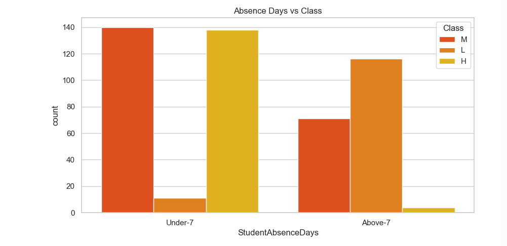
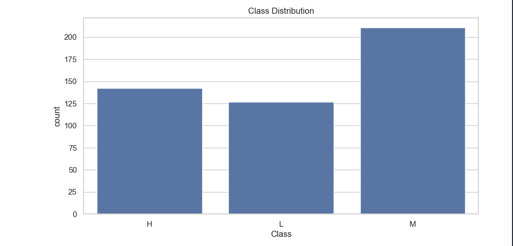
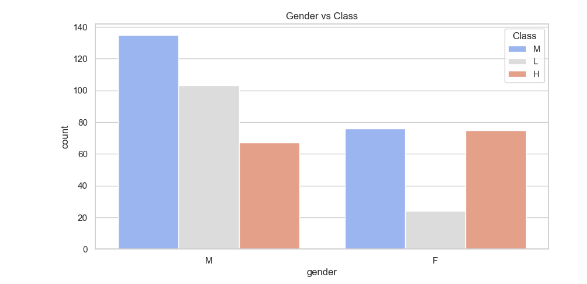
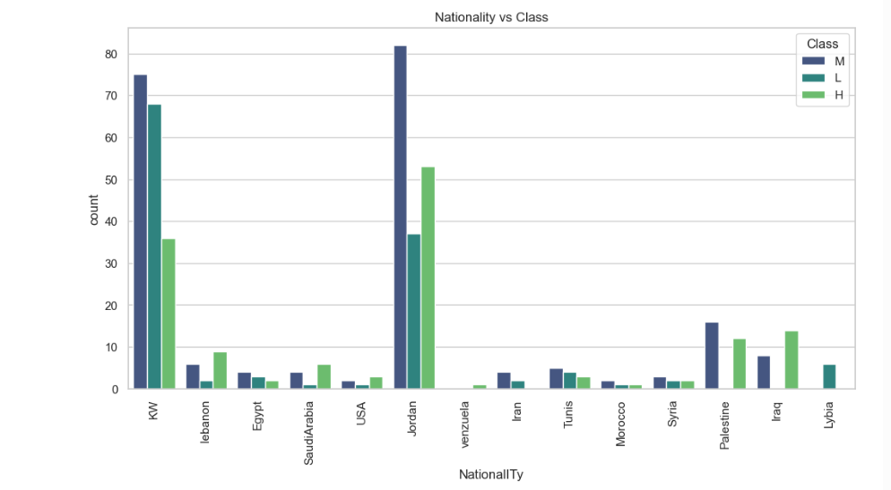
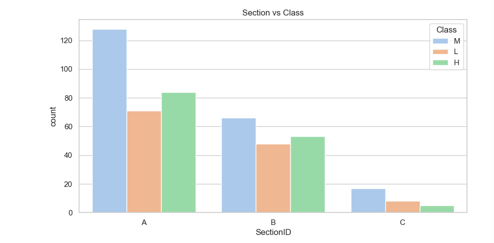
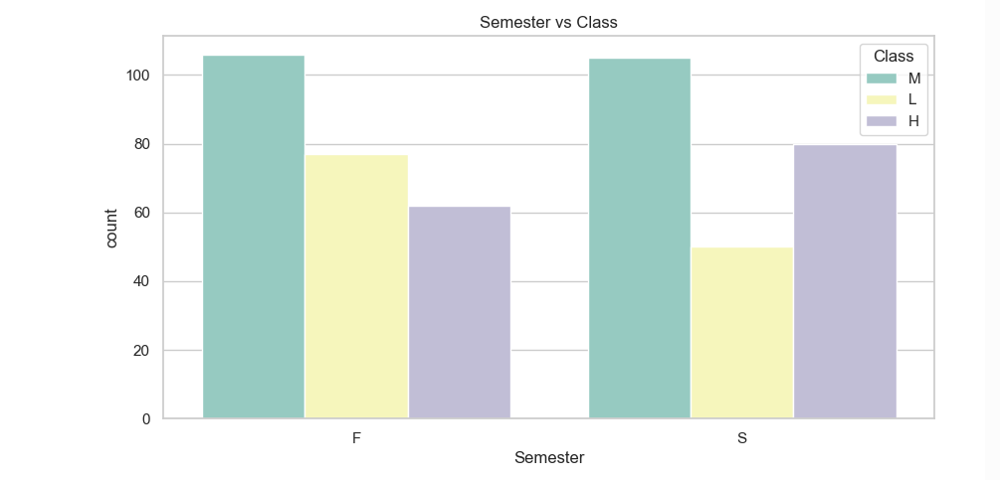
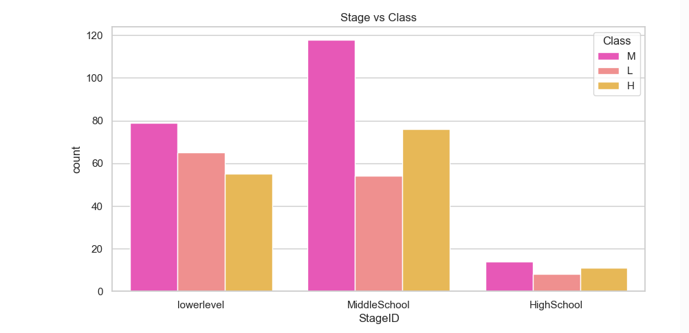
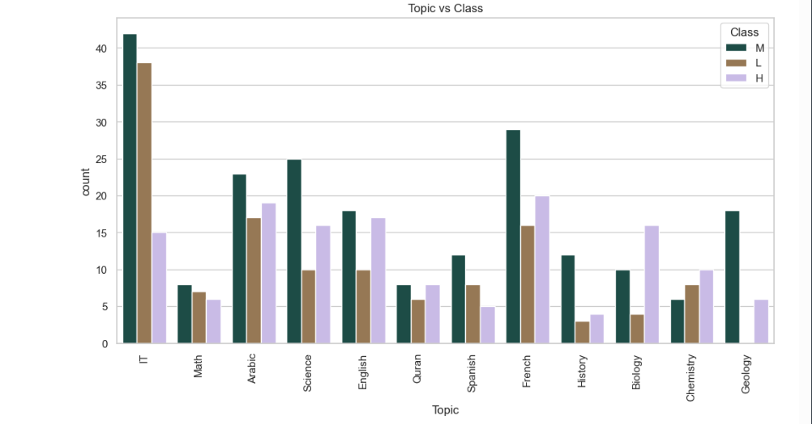

# Student Performance Analysis & Prediction
## Objective
Analyze student performance data to uncover trends across demographics and subjects, and predict students’ marks classification using machine learning.
This project demonstrates data preprocessing, visualization, model training, and predictive analysis in Python.

## Dataset
- File: AI-Data.csv
- Columns include: Gender, Nationality, Grade, Section, Topic, Stage, Absence Days, Marks Classification, etc.
- Rows: 5
- The dataset contains student performance metrics across different demographics and subjects.

## Tools & Technologies
* Python (pandas, numpy, matplotlib, seaborn, scikit-learn)
* Jupyter Notebook
* Power BI / Tableau (for dashboards)

## Features & Analysis Performed
- Data Exploration
- Checked distributions, missing values, correlations, and feature relevance
- Data Visualization
- Plotted marks classification by:
- Class counts
- Semester
- Gender
- Nationality
- Grade
- Section
- Topic
- Stage
- Absence Days
- Data Preprocessing
- Encoded categorical variables
- Removed irrelevant features
- Shuffled dataset for randomness
- Model Training & Evaluation
- Split dataset into training and testing sets
 - Trained multiple models:
- Decision Tree Classifier
- Random Forest Classifier
- Linear Perceptron
- Logistic Regression
- Neural Network (MLP Classifier)
- Measured accuracy and generated classification reports for all models

Predictive Analysis
Users can input custom student data to predict marks classification

## Key Insights
- The random Forest Classifier achieved the highest accuracy(83%), outperforming other models.
- Logistic Regression showed strong performance (76%), indicating good linear seperability in the data.
- Decision Tree achieved moderate accuracy (70%), serving as a strong baseline model.
- Ensemble methods (Random Forest) improved prediction accuracy compared to single model approaches.

Example Prediction:
- Input: Gender=F, Grade=10, Topic=Math, Absence Days=3
- Output: Predicted Marks Classification: High

## Visualizations
### Absence Days vs Class

### Class Distribution vs Class

### Gender vs Class

### Grade vs Class

### Nationality vs Class

### Section vs Class

### Semester vs Class

### Stage vs Class

### Topic vs Class

